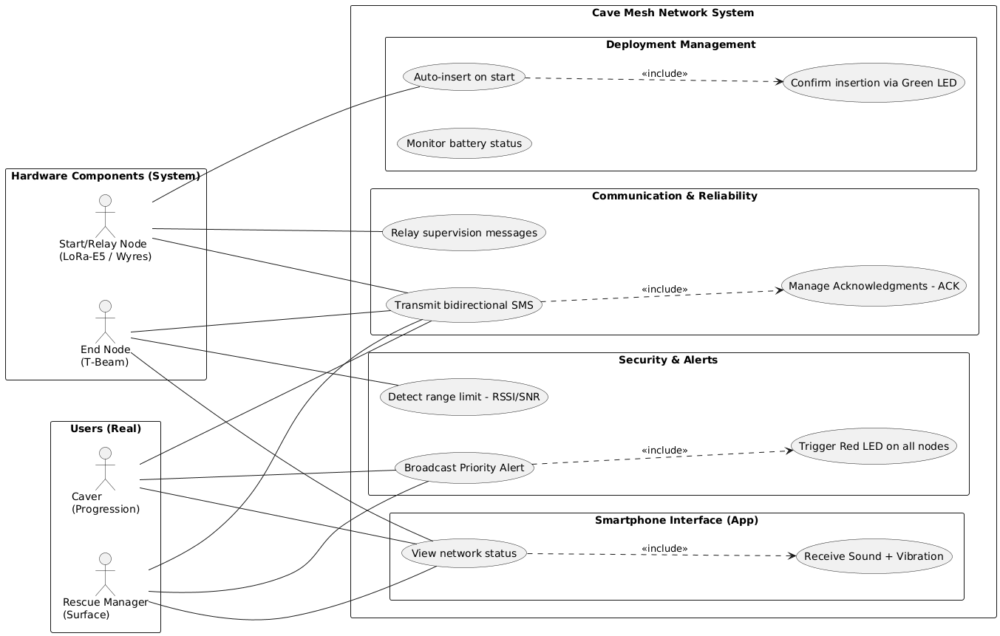
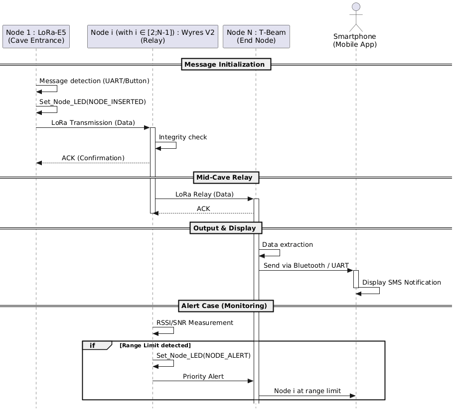

# Project INFO4: Wireless Mesh Network for Cave Rescue Operations

---

## Description

This project involves designing and implementing a LoRa communication system that allows people to keep contact with the outside world while moving underground (mostly in cave exploration). This is achieved using a flexible network of relay nodes. The system will use two LoRa nodes, two computers for programming, and an Android phone for testing.

The project runs from January 5, 2026 to March 30, 2026.

---

## Requirements

### Functional Requirements
- Reliable transmission between two connected nodes without losing information (The system must allow message exchange between the starting node and the ending node through a chain of intermediate nodes)
- Linear network structure
- Each node must communicate in both directions (each node can talk to the node before and after it to send messages both ways)
- Messages in the system are of three types: SMS, alerts, or network messages (network status or new node added to the chain)
- Detection of range limits between two connected nodes (the system detects when reaching the limit of the last node's range and warns the user to add a new node)
- User is notified when range limit is reached (sound or vibration)
- Alert messages are treated with higher priority and sent to all nodes in the chain and to the connected users (Alert messages trigger a red LED on each node and notify users with sound or vibration on their phone)
- Gradual network growth (the system deploys as users move deeper underground, allowing new relay nodes to be added at any time. New nodes automatically join the network and confirm this with a specific LED color (green))
- When a module powers on, it connects to the network and checks that communication is working properly (by testing connection and announcing itself to update network status)
- LED indicator for each node status (Off: No power / Orange: On but not connected / Green: Connected to network / Red: Alert message active)
- User-friendly smartphone application (allows sending and receiving text messages or alerts and shows network connection status: lost, connected, or limit reached)
- Reliable message delivery (with automatic resending if delivery fails (ACK mechanism))
- Network awareness (Nodes exchange messages to know the network state at all times: chain continuity, new node insertion, or network changes)
- Battery level monitoring and notification when battery is low (simple message on the app) (if physical implementation is not possible, battery check can be added to the API only)

### Non-Functional Requirements
- Reliability is more important than speed or delay
- Alert messages must always be sent first (highest priority)
- The system must work underground (radio signals are weakened and unpredictable, and the environment is changing: wet and unstable)
- Power consumption must be controlled (nodes run on rechargeable batteries and communications must use minimal energy)
- System must be simple and quick to use (minimal interface and easy-to-use app for fast communication)

---

## Equipment Used
- TBeam TTGO classic board
- Nucleo F411RE x2 (used only to program the different devices)
- Lora E5 Development Kit
- WyresV2 x2

## Meeting Notes
### First Meeting
- RP2040 module with low power consumption is a good idea
- Connect to network when powered on
- When starting, run algorithm and check network is working (communication possible + update network status)
- Check battery level of all modules (warn user if too low) (if too complex, can add to API only)
- Add extra LEDs if needed (GPIO ports available) // to check
- Avoid duplicate messages
- Focus a lot on reliability!
- Phone app should be very simple (SMS style)

---
## UML Diagrams

### Use-Case Diagram

### Message Sending Sequence Diagram

## Building After Clone

Prerequisites:
- STM32CubeIDE installed (recent version)
- `GNU Tools for STM32` toolchain available in the IDE

### Lora E5 Development Kit (`Loraprojet`)

Opening the project:
1. Clone the repository.
2. In STM32CubeIDE: `File > Open Projects from File System...`
3. Select the `Loraprojet` folder.
4. Run `Project > Clean` then `Build`.

Notes:
- Binary and object files in `Loraprojet/Debug` are generated locally and are not needed in the repository.
- The project stores Eclipse configuration files (`.project`, `.cproject`, `.settings`) to ensure it opens correctly on another machine.

### WyresV2

Opening the project:
1. Clone the repository.
2. In STM32CubeIDE: `File > Open Projects from File System...`
3. Select the `WyresV2` folder.
4. Run `Project > Clean` then `Build`.

Notes:
- Files in `WyresV2/Debug` are generated locally and should not be committed to share the project.
- Portable build paths are handled by `.project/.cproject`; running `Clean` regenerates local makefiles.

